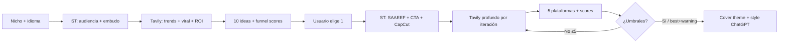

# Social Media Studio (local)

Cursor-native workflow aligned with `SOCIAL-MEDIA/SocialMedia` and
`SOCIAL-MEDIA/prompt-social-media-generator-v2.md` (+ Argenis TOFU/MOFU/BOFU
prompt). Follow hard rules in `.claude/rules/social-media-studio.md`.

## Workflow

```
Progress:
- [ ] 0. Select niche + language (mandatory — blocks all research)
- [ ] 1. Load/update SOCIAL-MEDIA/output/social-generation-cache.json
- [ ] 2. Sequential thinking — niche audience + funnel mix + EEAT credibility
- [ ] 3. Tavily research (niche) -> 10 viral ideas with scores + funnel_stage
- [ ] 4. User selects exactly one idea (by number or title)
- [ ] 5. Sequential thinking — SAAEEF, CTA by stage, sources, CapCut beats
- [ ] 6. Draft loop (max 5): Tavily -> write 5 platforms + CapCut -> score
- [ ] 7. Save package under SOCIAL-MEDIA/output/
- [ ] 8. Emit ChatGPT cover prompts (theme + style, routes A/B/C)
- [ ] 9. Offer /social-cover only, refine, or paste into CMS
```



### 0. Select niche + language (before anything else)

**Do not run Tavily, sequential thinking for ideation, or generation until
this step is complete.**

1. Read `.claude/skills/social-media-studio/references/niches.md`.
2. Present niche presets as a numbered list (name + research niche string).
3. Use **AskQuestion** (or explicit reply) for:
   - Niche: one of the presets **or** Custom (then ask for one sentence).
   - Language: `es` | `en` | `pt-PT` (labels from niches.md).
4. Optional: business goal (`awareness|engagement|viral|leads|sales|community`)
   and brand voice (`professional|conversational|trendy|inspirational|humorous`).
5. If the user already named a niche/language in the command or chat, confirm it;
   if ambiguous, ask again — **never default** niche or language.
6. Write `selected_niche` + `language` to `social-generation-cache.json` per
   `references/cache-schema.md`.

Optional: ask for a **topic steer** (max one sentence) inside the niche; store
as `optional_topic_steer`.

### 1. Session cache

Read or create `SOCIAL-MEDIA/output/social-generation-cache.json`. All later
steps must include niche slug and language in filenames and run logs.

### 2. Sequential thinking (pre-research)

One `sequentialthinking` pass: who follows this niche, pain points, credible
first-hand angles for the author, how to balance TOFU/MOFU/BOFU across 10
ideas, risks of generic AI slop / fake trends.

### 3. Tavily — 10 viral ideas

Follow `references/tavily-queries.md` step 1. Niche =
`selected_niche.research_niche` (+ optional steer).

Produce a Markdown table of **exactly 10** ideas:

| # | Title | Hook | Funnel | Format | Virality | ROI | Key trend | Why it works |

Requirements:
- Mix funnel stages (not all TOFU).
- At least 3 ideas with estimated_virality ≥ 80.
- Sort by `(estimated_virality + estimated_roi) / 2` descending as a hint; user
  still picks manually.

### 4. User selection

Stop and wait for **one** idea (# or title). Update cache with
`selected_idea_index`, `selected_idea`, and `funnel_stage`.

### 5. Sequential thinking (pre-draft)

Plan SAAEEF outline, CTA matched to funnel stage, 2 Tavily source targets,
CapCut retention beats + target duration for the stage, image route A/B/C.

### 6. Draft quality loop

Follow `references/scoring-rubric.md` and Tavily iteration table in
`references/tavily-queries.md`.

Generate full package:
- Core: headline, body (SAAEEF), CTA, hashtags
- Platforms: LinkedIn, Twitter/X, Instagram (+ CapCut), Facebook, TikTok (+ CapCut)
- EEAT signal bullets (experience / expertise / authority / trust)
- Honest self-scores for all five metrics

If any fail, iterate (max 5) with specific weakness feedback via
`sequentialthinking`.

### 7. Save package

`SOCIAL-MEDIA/output/{niche-slug}_{lang}_{date}_{slug-title}.md` with YAML
frontmatter:

```yaml
---
niche: "Laravel & PHP backends"
research_niche: "Laravel PHP backend development"
language: es
funnel_stage: tofu
business_goal: awareness
brand_voice: conversational
title: "..."
scores:
  human_writing_index: 0
  virality_score: 0
  engagement_score: 0
  roi_score: 0
  trend_alignment: 0
all_scores_pass: false
quality_warning: false
iterations_required: 1
---
```

Body sections (in order): trend + funnel note, LinkedIn, Twitter/X, Instagram
caption, Facebook, TikTok caption, CapCut packages (IG + TikTok tables),
research sources, scores PASS/FAIL table.

### 8. ChatGPT cover prompts

Write `SOCIAL-MEDIA/output/{same-base}_cover-prompts.md` with:
- Cover concept (route A/B/C) + English copy-paste prompt (theme + style)
- Per-platform image prompt when aspect differs (LinkedIn 16:9, IG 1:1 / 4:5,
  TikTok 9:16 thumb)

User pastes into ChatGPT / DALL·E — no requirement to call image APIs from
Cursor.

### 9. Next actions

Offer: refine draft, `/social-cover` from saved file, or map into CMS
`SocialMediaContent` fields when publishing.

## References

- Niches / language: `references/niches.md`
- Author voice: `references/author-context.md` (Argenis / argenis.dev)
- Platforms + CapCut: `references/platforms.md`
- Tavily: `references/tavily-queries.md`
- Scores: `references/scoring-rubric.md`
- Cache: `references/cache-schema.md`
- Product specs: `SOCIAL-MEDIA/prompt-social-media-generator-v2.md`,
  `SOCIAL-MEDIA/prompt-contenido-social-argenis-TOFU-BOFU-MOFU.md`
